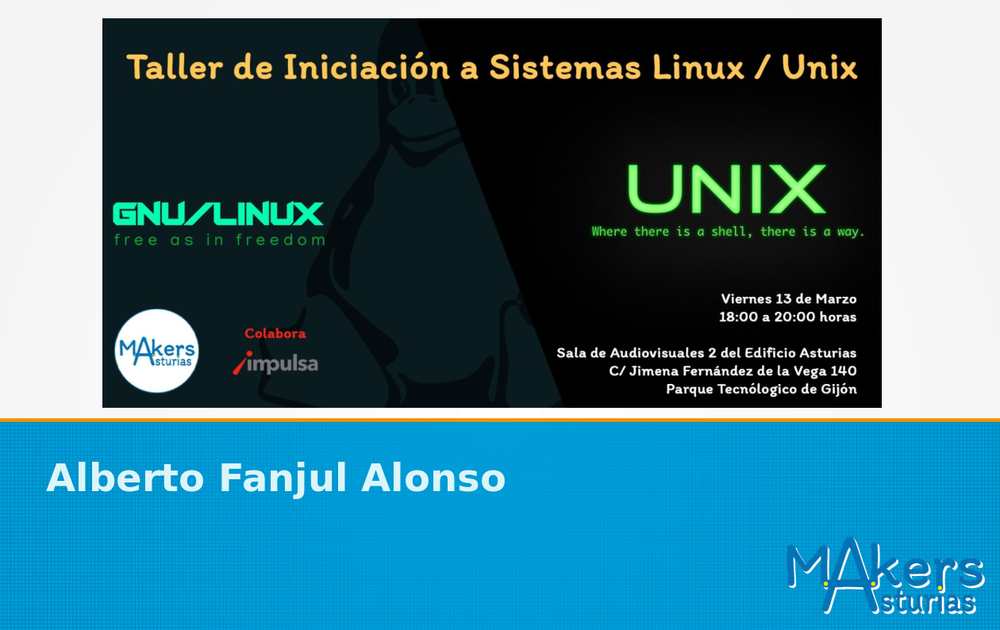

# Taller de Unix/Linux

## Introducción

Desde [MakersAsturias](http://makersasturias.org/) hemos detectado la necesidad de explicar que es Linux, ya que muchos proyectos "maker" se basan en él.

## Contexto

Linux ([evitemos las flamewars](https://es.wikipedia.org/wiki/Controversia_por_la_denominaci%C3%B3n_GNU/Linux)) es un  sistema operativo. En definitiva es un software que sirve para que un hardware (CPU, RAM, disco duro, pantalla, teclado y ratón) ejecute tareas.

Para los makers esto puede significar programar un arduino, flashear un drone, controlar una impresora 3D, diseñar una pieza.

Existen otros sistemas operativos, linux es uno más.

## Filosofia Maker

Linux está basado en una serie de componentes de software que generalmente se desarrollan como FOSS y que ciertos organismos se encargan de juntar y ofrecer a la comunidad. Son las llamadas distribuciones o distros.

Las hay mas sencillas de usar, mas enfocadas a desarrollo, a seguridad, a educación a música... Simplemente enumerar algunas de ellas:

- [Ubuntu](https://ubuntu.com/)
- [Fedora](https://getfedora.org/es/)
- [Arch linux](https://www.archlinux.org/)
- [SuSe](https://www.suse.com/es-es/)
- [CentOS](www.centos.org) 

Hay muchas mas, si algún día queréis generar casi desde cero una distribución de linux visitad [Linux from scratch](http://www.linuxfromscratch.org/)

## Instalación

Linux se puede instalar desde cero en un ordenador "limpio" o sobre un ordenador con otro sistema operativo ya instalado. Veamos las opciones disponibles

### Live CD/USB

Si se desea probar una de estas distros, lo mas sencillo es descargar una iso (imagen de CD/DVD) y arrancar en modo Live. Es un modo que arranca todo en memoria (sin modificar tu disco duro) para que veas como sería usar esa distribución de linux en tu ordenador.

- [Ubuntu Live](https://ubuntu.com/tutorials/try-ubuntu-before-you-install#1-getting-started)
- [Fedora Live](https://fedoraproject.org/wiki/FedoraLiveCD/es)

### Dual Boot

No es obligatorio tener un solo sistema operativo en un ordenador, si se quiere se puede elegir cual arrancar al encender el ordenador, es lo que se llama dual boot, (aunque es posible optar a tres, cuatro o mas opciones de arranque) Según la distribución que os interese googlead sobre dual boot "distro que os interese" y encontrareis guias sencillas para hacerlo. Aqui detallaremos algunos ejemplos:

- [ubuntu dual boot](https://www.genbeta.com/paso-a-paso/linux-paso-a-paso-instalar-ubuntu-con-dual-boot-junto-a-windows-10)
- [Fedora dual boot](https://www.solvetic.com/tutoriales/article/4514-como-instalar-fedora-27-con-windows-10-arranque-dual-boot/)
- [arch linux dual boot](https://wiki.archlinux.org/index.php/Dual_boot_with_Windows_(Espa%C3%B1ol))

## Colaboración

La intención de este taller es facilitar la comprensión de lo que Linux como sistema operativo puede ofrecer y como instalarlo y usarlo. Por ello se hacen algunas generalizaciones y simplificaciones que podrían mejorarse, cualquier sugerencia es bienvenida, esperamos tus issues y pull request!
